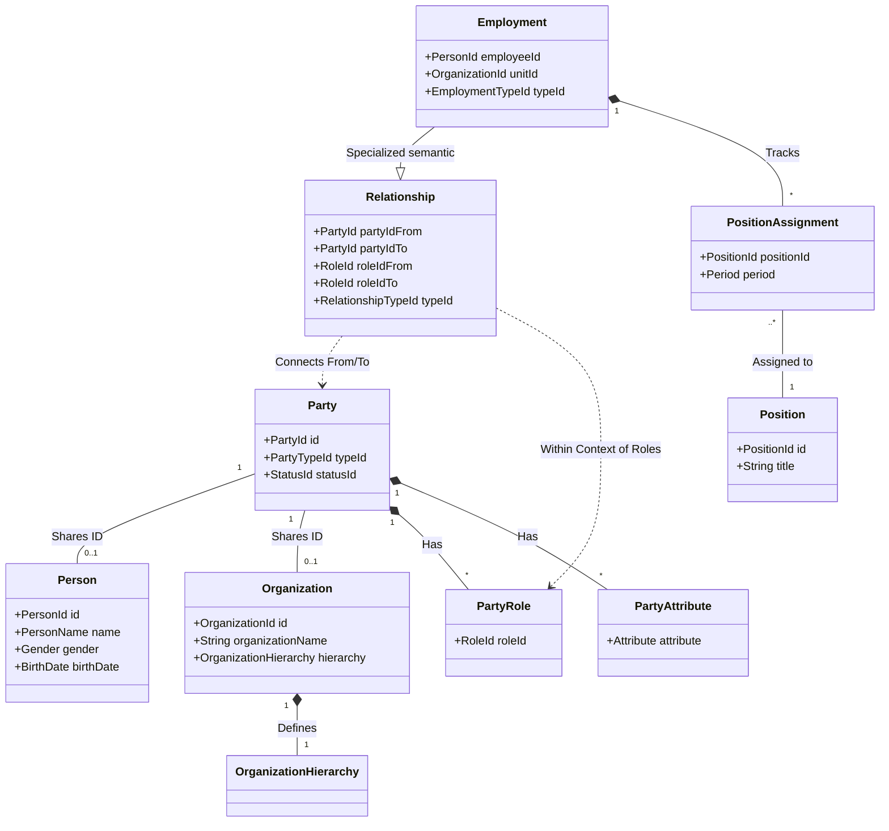

# Báo cáo Phân tích Mô hình Domain: Party Management System

Báo cáo này cung cấp cái nhìn chi tiết về cấu trúc các Domain Object trong dự án, vai trò của chúng, mối quan hệ tương hỗ và sự so sánh với mô hình **Party Model** kinh điển của Len Silverston trong cuốn *The Data Model Resource Book*.

---

## 1. Phân tích chi tiết các Module Domain

Dự án được thiết kế theo kiến trúc **Domain-Driven Design (DDD)**, chia nhỏ các nghiệp vụ quản lý Party thành 4 module chuyên biệt:

### 1.1. Module `party` (Hạt nhân hệ thống)
Đây là module quan trọng nhất, định nghĩa "chủ thể" của mọi hoạt động.

*   **`Party` (Aggregate Root):** 
    *   **Vai trò:** Là một thực thể khái quát hóa (Generalization) cho bất kỳ cá nhân hoặc tổ chức nào.
    *   **Thành phần:** Chứa `PartyTypeId` để phân loại, `StatusId` để quản lý trạng thái hoạt động. Nó sở hữu danh sách `PartyRole` (vai trò) và `PartyAttribute` (các thuộc tính động).
*   **`Person` (Aggregate Root):**
    *   **Vai trò:** Chứa thông tin đặc thù của con người (Cá nhân).
    *   **Thuộc tính:** `PersonName` (Họ, tên đệm, tên), `CitizenInfo` (CCCD/CMND), `Gender`, `BirthDate`, `MaritalStatus`. 
    *   **Liên kết:** Chia sẻ chung ID với `Party` (1-1 relationship).
*   **`Organization` (Aggregate Root):**
    *   **Vai trò:** Chứa thông tin đặc thù của một tổ chức/đơn vị.
    *   **Thuộc tính:** `organizationName`, `organizationCode`, `logoImageUrl`, `numberOfEmployees`.
    *   **Đặc điểm:** Tích hợp `OrganizationHierarchy` để quản lý cấu trúc cây (Root Organization vs Organization Unit) thông qua thuật toán `Interval` (Nested Sets/Materialized Path).
*   **`PartyRole` & `PartyAttribute`:**
    *   **Role:** Cho phép một Party đảm nhận nhiều vị trí (Khách hàng, NCC, Nhân viên) trong các ngữ cảnh khác nhau.
    *   **Attribute:** Sử dụng mô hình EAV (Entity-Attribute-Value) để lưu trữ các thông tin như Email, Phone, Address mà không làm phình to bảng dữ liệu chính.

### 1.2. Module `relationship` (Sợi dây liên kết)
*   **`Relationship` (Aggregate Root):**
    *   **Vai trò:** Quản lý mọi loại tương tác giữa các Party.
    *   **Cấu trúc:** Kết nối cặp `(partyIdFrom, roleIdFrom)` với `(partyIdTo, roleIdTo)`. 
    *   **Ví dụ:** "Nguyễn Văn A" (Vai trò: Thành viên) thuộc "Phòng IT" (Vai trò: Đơn vị quản lý).

### 1.3. Module `employment` (Nghiệp vụ Nhân sự)
*   **`Employment` (Aggregate Root):** 
    *   **Vai trò:** Cụ thể hóa mối quan hệ làm việc giữa một `Person` và một `Organization`. 
    *   **Thành phần:** Liên kết `employeeId` (Person) và `unitId` (Organization). Quản lý danh sách `PositionAssignment` (Bổ nhiệm vị trí).
*   **`Position` & `PositionAssignment`:**
    *   **Position:** Danh mục các chức vụ (ví dụ: Giám đốc, Trưởng phòng).
    *   **Assignment:** Giao một chức vụ cụ thể cho nhân viên trong một khoảng thời gian (`Period`).

### 1.4. Module `catalogue` (Metadata/Lookup Data)
*   Cung cấp các bảng danh mục như `PartyType`, `RelationshipType`, `Role`, `Status`. Điều này giúp hệ thống có khả năng cấu hình cao mà không cần can thiệp vào mã nguồn khi cần thêm loại quan hệ hoặc vai trò mới.

---

## 2. Mối quan hệ giữa các Domain Object

Sơ đồ tư duy về sự kết nối:
1.  **Identity:** Một thực thể thực tế được định danh bằng một `Party`. Tùy theo loại, nó sẽ có thêm dữ liệu chi tiết trong `Person` hoặc `Organization`.
2.  **Context:** `Party` không tồn tại độc lập mà luôn đi kèm với `PartyRole` để xác định quyền hạn/nghĩa vụ.
3.  **Interaction:** Hai `Party` tương tác với nhau thông qua `Relationship`.
4.  **Specialization:** `Employment` là một "specialized relationship" chuyên biệt cho mảng nhân sự, kết nối giữa người lao động và đơn vị sử dụng lao động.

### Sơ đồ quan hệ (Domain Model Diagram)

---

## 3. So sánh với Party Model của Len Silverston

Mô hình hiện tại của dự án có sự tương đồng rất lớn với mô hình chuẩn trong sách *The Data Model Resource Book (Vol 1)* nhưng có những cải tiến về mặt kỹ thuật:

| Tiêu chí                   | Mô hình Silverston                                              | Triển khai trong Dự án                                 | Nhận xét                                                                                      |
|:---------------------------|:----------------------------------------------------------------|:-------------------------------------------------------|:----------------------------------------------------------------------------------------------|
| **Supertypes / Subtypes**  | Sử dụng kế thừa (Inheritance) giữa Party, Person, Organization. | Sử dụng **Composition** và **Shared ID**.              | Phù hợp hơn với Microservices và DDD, giúp các module độc lập hơn.                            |
| **Party Relationship**     | From Role A to Role B.                                          | **Khớp 100%**. Có `partyId` và `roleId` cho cả 2 phía. | Đạt chuẩn thiết kế linh hoạt nhất của Silverston.                                             |
| **Contact Mechanism**      | Các bảng riêng: Postal Address, Phone, Email.                   | Sử dụng **PartyAttribute** (EAV model).                | Dự án ưu tiên sự linh hoạt (Dynamic attributes) hơn là tính cấu trúc chặt chẽ của Silverston. |
| **Organization Hierarchy** | Thường dùng bảng quan hệ đệ quy đơn giản.                       | Sử dụng **Interval Value Object**.                     | Cách tiếp cận của dự án hiện đại hơn, tối ưu hóa cho các truy vấn cây tổ chức phức tạp.       |
| **Employment**             | Là một subtype của Relationship.                                | Được tách thành một **Module/Aggregate riêng**.        | Phù hợp với việc mở rộng các tính năng nhân sự chuyên sâu (lương, vị trí, đánh giá).          |

---

## 4. Kết luận kiến trúc

1.  **Tính Linh hoạt:** Việc sử dụng `PartyRole` và `Relationship` cho phép hệ thống mở rộng vô hạn các loại quan hệ (Bố-con, Công ty mẹ-con, Nhà cung cấp-Khách hàng) mà không cần thay đổi Database Schema.
2.  **Tính Đóng gói:** Các module được phân tách rõ ràng. Ví dụ, module `employment` chỉ quan tâm đến logic nhân sự, dựa trên các ID của module `party`.
3.  **Tính Tuân thủ:** Dự án bám sát các tinh hoa của mô hình dữ liệu chuẩn công nghiệp (Silverston), đảm bảo hệ thống có nền tảng vững chắc để phát triển các tính năng ERP/CRM phức tạp về sau.

---
*Báo cáo được thực hiện bởi Gemini CLI - 2026*
