# Party Model Integration — Overview

## 1. Service Boundaries

Hệ thống tách thành 3 service theo domain concern:

| Service            | Owns                                                                          | Không biết                          |
|--------------------|-------------------------------------------------------------------------------|-------------------------------------|
| `admin-service`    | User, Role, RoleContext, TenantSubRoleAssignment, ABAC                        | Who lives where, agreement details  |
| `party-service`    | Party, Person, Organization, Household, PartyRelationship, Employment, PartyIdentification | FixedAsset, RoleContext |
| `property-service` | FixedAsset, OccupancyAgreement                                                | User, Role                          |

Cross-service references dùng **ID only** — không import domain logic, không direct call giữa services. Coordinate qua event.

---

## 2. ERD Tổng Thể

```mermaid
erDiagram

    %% ═══════════════════════════════
    %%  PARTY SERVICE
    %% ═══════════════════════════════

    PARTY {
        string id PK
        string type "PERSON | ORGANIZATION | HOUSEHOLD"
        string name
        string status
    }
    PERSON {
        string party_id PK,FK
        string first_name
        string last_name
        date dob
        string gender
    }
    ORGANIZATION {
        string party_id PK,FK
        string org_type "BQL | TENANT | VENDOR | OTHER"
        string tax_id
        string registration_no
    }
    HOUSEHOLD {
        string party_id PK,FK
        string head_person_id FK
    }
    PARTY_IDENTIFICATION {
        string id PK
        string party_id FK
        string type "CCCD | TAX_ID | PASSPORT | BUSINESS_REG"
        string value
    }
    PARTY_RELATIONSHIP {
        string id PK
        string from_party_id FK
        string to_party_id FK
        string type "MEMBER_OF | EMPLOYED_BY"
        string from_role "enum PartyRoleType"
        string to_role "enum PartyRoleType"
        date start_date
        date end_date
        string status "ACTIVE | ENDED"
    }
    EMPLOYMENT {
        string id PK
        string relationship_id FK
        string employee_id "ref → PARTY (Person)"
        string org_id "ref → PARTY (BQL Org)"
        string employment_type "FULL_TIME | PART_TIME | CONTRACT"
        string status "ACTIVE | TERMINATED"
        date start_date
        date end_date
    }
    POSITION_ASSIGNMENT {
        string id PK
        string employment_id FK
        string position "enum BQLPosition"
        string department
        date start_date
        date end_date
    }

    PARTY ||--o| PERSON : "shared ID (separate AR)"
    PARTY ||--o| ORGANIZATION : "shared ID (separate AR)"
    PARTY ||--o| HOUSEHOLD : "shared ID (separate AR)"
    HOUSEHOLD }o--|| PERSON : "head"
    PARTY ||--o{ PARTY_IDENTIFICATION : "identifies"
    PARTY ||--o{ PARTY_RELATIONSHIP : "from"
    PARTY ||--o{ PARTY_RELATIONSHIP : "to"
    PARTY_RELATIONSHIP ||--o| EMPLOYMENT : "specializes"
    EMPLOYMENT ||--o{ POSITION_ASSIGNMENT : "tracks"

    %% ═══════════════════════════════
    %%  PROPERTY SERVICE
    %% ═══════════════════════════════

    FIXED_ASSET {
        string id PK
        string parent_id FK
        string path "materialized path /bldg/flr/unit"
        string type "BUILDING | FLOOR | RESIDENTIAL_UNIT | COMMERCIAL_SPACE | FACILITY | MEETING_ROOM | PARKING_SLOT | COMMON_AREA | EQUIPMENT"
        string name
        string code
        int sequence_no
        string status "ACTIVE | INACTIVE | UNDER_MAINTENANCE"
    }
    OCCUPANCY_AGREEMENT {
        string id PK
        string party_id "ref → party-service"
        string asset_id FK
        string agreement_type "OWNERSHIP | LEASE"
        string status "PENDING | ACTIVE | TERMINATED | EXPIRED"
        date start_date
        date end_date
        string contract_ref
    }

    FIXED_ASSET ||--o{ FIXED_ASSET : "parent"
    FIXED_ASSET ||--o{ OCCUPANCY_AGREEMENT : "asset"

    %% ═══════════════════════════════
    %%  ADMIN SERVICE
    %% ═══════════════════════════════

    USER {
        string id PK
        string username
        string email
        string status
        string party_id "ref → party-service (nullable)"
    }
    ROLE {
        string id PK
        string name
        string scope "ADMIN | OPERATOR | TENANT | RESIDENT"
    }
    ROLE_CONTEXT {
        string id PK
        string user_id FK
        string scope "ADMIN | OPERATOR | TENANT | RESIDENT"
        string org_id "ref → party or fixed_asset"
        string org_type "PARTY | FIXED_ASSET"
        string status "ACTIVE | REVOKED"
    }
    ROLE_CONTEXT_ROLE {
        string role_context_id FK
        string role_id FK
    }
    TENANT_SUB_ROLE_ASSIGNMENT {
        string id PK
        string user_id FK
        string org_id "ref → party-service Tenant Org"
        string sub_role "TENANT_MANAGER | TENANT_FINANCE | TENANT_HR"
        string assigned_by FK
        datetime assigned_at
    }

    USER ||--o{ ROLE_CONTEXT : "has"
    ROLE_CONTEXT ||--o{ ROLE_CONTEXT_ROLE : "has"
    ROLE ||--o{ ROLE_CONTEXT_ROLE : "assigned to"
    USER ||--o{ TENANT_SUB_ROLE_ASSIGNMENT : "has"
```



---

## 3. RoleContext — orgId Mapping

`orgId` là **scope dimension** (ranh giới dữ liệu), không phải identity:

| Scope      | orgId trỏ đến                  | Lý do                                         |
|------------|--------------------------------|-----------------------------------------------|
| `ADMIN`    | `null`                         | Platform-wide, không có ranh giới             |
| `OPERATOR` | `FixedAsset.id` (BUILDING)     | Scope là per-building                         |
| `TENANT`   | `Party.id` (Organization)      | 1 Or g có thể thuê nhiều unit → Org là anchor |
| `RESIDENT` | `FixedAsset.id` (UNIT)         | Scope là căn hộ cụ thể đang chiếm dụng        |

---

## 4. TENANT Permission — 2 Layer

```
Layer 1 — Portal access (BQL owns)
  role_context { scope=TENANT, org_id=companyZ, roles=[TENANT_EMPLOYEE] }
  BQL grant khi onboard. BQL revoke khi OccupancyAgreement terminate.
  TENANT_ADMIN không được modify layer này.

Layer 2 — Feature access (TENANT_ADMIN owns)
  tenant_sub_role_assignment { user_id, org_id, sub_role }
  TENANT_ADMIN assign từ tập sub-roles platform define sẵn.
  Không tạo được role type mới, không viết custom policy.
```

Token generation merge cả 2 layer. Audit trail tách biệt theo owner.

---

## 5. Cross-Service Event Contracts

### 5.1 Bootstrap Flow

```
ADMIN tạo Building:
  property-service → emit BuildingCreated { buildingId, name }
  admin-service    → cache building reference (validate khi assign OPERATOR RoleContext)

ADMIN tạo BQL Org:
  party-service    → emit OrganizationCreated { partyId, name, orgType=BQL }
  admin-service    → cache org reference
```

### 5.2 OccupancyAgreement Lifecycle

```
BQL activate Agreement:
  property-service → emit OccupancyAgreementActivated {
                       agreementId, partyId, partyType, unitId, agreementType
                     }
  admin-service    → nếu partyType=HOUSEHOLD: query party-service lấy members
                   → tạo RoleContext { RESIDENT, orgId=unitId } cho từng person
                   → nếu agreementType=LEASE + partyType=ORGANIZATION:
                      tạo RoleContext { TENANT, orgId=partyId } cho TENANT_ADMIN

BQL terminate Agreement:
  property-service → emit OccupancyAgreementTerminated { agreementId, unitId, partyId }
  admin-service    → revoke RoleContext WHERE scope=RESIDENT AND org_id=unitId
                   → nếu TENANT: revoke RoleContext WHERE scope=TENANT AND org_id=partyId
```

### 5.3 Employment Lifecycle

```
BQL tạo Employment:
  party-service    → emit EmploymentCreated { employmentId, personId, orgId }
  admin-service    → basis để assign OPERATOR RoleContext (BQL thực hiện thủ công sau đó)

BQL terminate Employment:
  party-service    → emit EmploymentTerminated { employmentId, personId, orgId }
  admin-service    → revoke RoleContext { OPERATOR } WHERE user.party_id=personId AND org_id=building
```

---

## 6. Admin Bootstrap Sequence

Chỉ 3 việc SUPER_ADMIN làm khi onboard building mới:

```
1. Tạo Building (FixedAsset type=BUILDING)          → property-service
2. Tạo BQL Organization (Party orgType=BQL)         → party-service
3. Tạo User + assign RoleContext { OPERATOR, buildingId } → admin-service
```

Mọi thứ còn lại (Floor, Unit, Employment, Tenant, Resident) → BQL_MANAGER làm trong OPERATOR portal.

---

## 7. User → Party Link

```
user.party_id = null   → SUPER_ADMIN hoặc system/service account
user.party_id != null  → human user (Person trong party-service)

Rule: scope != ADMIN → party_id bắt buộc
```

**SUPER_ADMIN cross-portal access:**
- Phase 1: pure separation — SUPER_ADMIN chỉ ở ADMIN portal, tạo user riêng nếu cần vào portal khác
- Phase 2 (khi có nhu cầu support): user impersonation — token thêm optional claim `impersonation{}`, thêm bảng `impersonation_session` + `impersonation_audit_log`. Zero impact lên data hiện tại.

---

## 8. Enums

```java
enum PartyType                { PERSON, ORGANIZATION, HOUSEHOLD }
enum OrgType                  { BQL, TENANT, VENDOR, OTHER }
enum PartyRelationshipType    { MEMBER_OF, EMPLOYED_BY }
enum PartyRoleType            { MEMBER, HEAD, EMPLOYEE, EMPLOYER, LESSOR, LESSEE }
enum PartyIdentificationType  { CCCD, TAX_ID, PASSPORT, BUSINESS_REG }
enum EmploymentType           { FULL_TIME, PART_TIME, CONTRACT }
enum EmploymentStatus         { ACTIVE, TERMINATED }
enum FixedAssetType           { BUILDING, FLOOR, RESIDENTIAL_UNIT, COMMERCIAL_SPACE,
                                FACILITY, MEETING_ROOM, PARKING_SLOT, COMMON_AREA, EQUIPMENT }
enum OccupancyAgreementType   { OWNERSHIP, LEASE }
enum OccupancyAgreementStatus { PENDING, ACTIVE, TERMINATED, EXPIRED }
enum RoleContextScope         { ADMIN, OPERATOR, TENANT, RESIDENT }
enum RoleContextStatus        { ACTIVE, REVOKED }
enum BQLPosition              { MANAGER, DEPUTY_MANAGER, FINANCE, TECHNICAL, SECURITY, RECEPTIONIST, STAFF }
enum TenantSubRole            { TENANT_MANAGER, TENANT_FINANCE, TENANT_HR }
```

---

## 9. Key Design Decisions

| #  | Decision                                    | Rationale                                                                                    |
|----|---------------------------------------------|----------------------------------------------------------------------------------------------|
| 1  | Person/Organization/Household là AR riêng   | Composition + shared ID — mỗi subtype có Repository và Command riêng, tạo atomic tại app layer |
| 2  | FixedAsset tách khỏi Party                  | Party = legal identity, FixedAsset = physical entity                                         |
| 3  | Household không gộp vào Organization        | Household là informal group, không có pháp nhân                                              |
| 4  | PartyRole là enum, không phải entity        | Role types cố định, ít — không cần CRUD                                                      |
| 5  | Employment là Aggregate Root riêng          | Lifecycle riêng (ACTIVE/TERMINATED độc lập với relationship), có PositionAssignment history  |
| 6  | Không có Agreement supertype                | OccupancyAgreement standalone — domain logic khác nhau, không unify                          |
| 7  | Employment chỉ cho BQL Org                  | Hệ thống không quản lý HR của Tenant/Resident                                                |
| 8  | TENANT permission — 2 layer tách biệt       | BQL owns portal access (RoleContext), TENANT_ADMIN owns feature access (sub-role assignment) |
| 9  | TENANT portal scope = building-context only | Apartcom là BMS, không phản ánh nghiệp vụ nội bộ của tenant                                  |
| 10 | Cross-service qua event                     | Tránh tight coupling, cho phép async, audit trail tự nhiên                                   |
| 11 | Silverston selective ~40-50%                | Full implementation overkill ở scale on-premise                                              |
